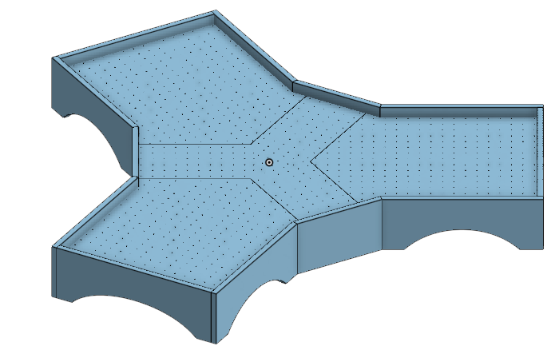

# CADs
## 3D Printed Parts
Based on JJRobots' original project, the mecanism of the robot is mostly unchanged. The 3D Printed parts can be found on the *Thingiverse* page of the original project.

- https://www.thingiverse.com/thing:1804534

Since the table differs from the one used in the original project, the stick and the puck were redesigned to a proper size. They can be found in the **Game Pieces** directory. The one used in *The Hockus Pockus Project* were printed with a 20% fill level, which should be enough.

## Table
The pieces used to make the table can be found in the **Table** directory. Here's a preview of the result:

The table is composed of a middle section, and 3 side sections. 