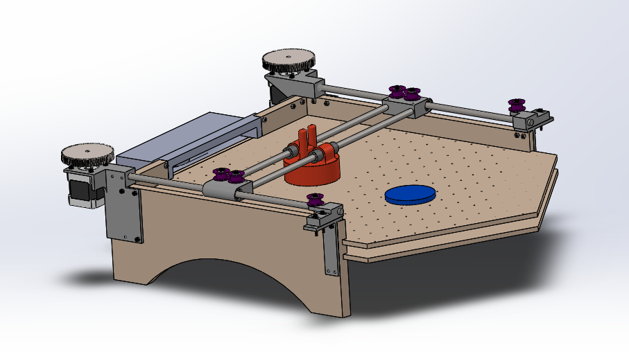

# CADs
This section contains all of the CADs needed to build the project. In the Wiki, you can find the steps to follow in order to assemble the whole table and mecanism.

## Table
The pieces used to make the table can be found in the **Table** directory. It includes the parts of a play zone and the center pieces for a 2 or 3 player table. The play zone looks like this:

    

The center piece changes with the number of players. Here are the examples for a 2 and 3 player table.

    
    

## Mecanism
The mecanism was inspired by *JJRobots* original design. A few changes were needed to allow ajustments. Here's the result:

    

## Game Pieces

This folder includes the puck and the player's stick. 