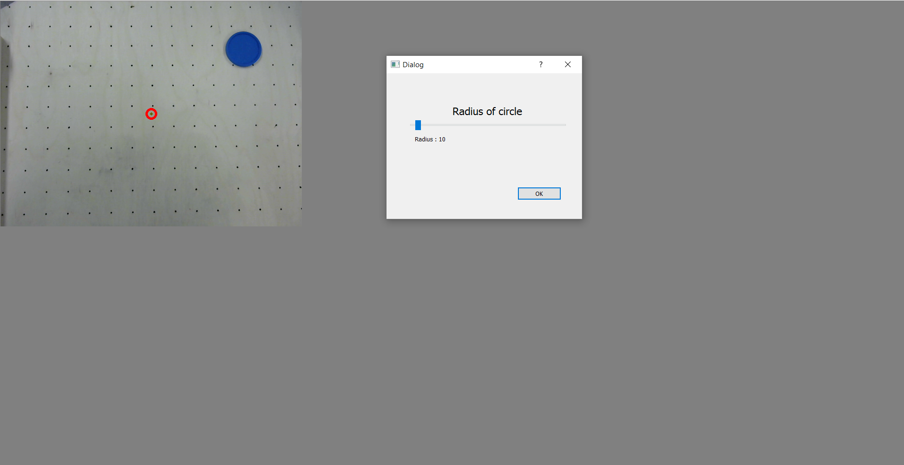
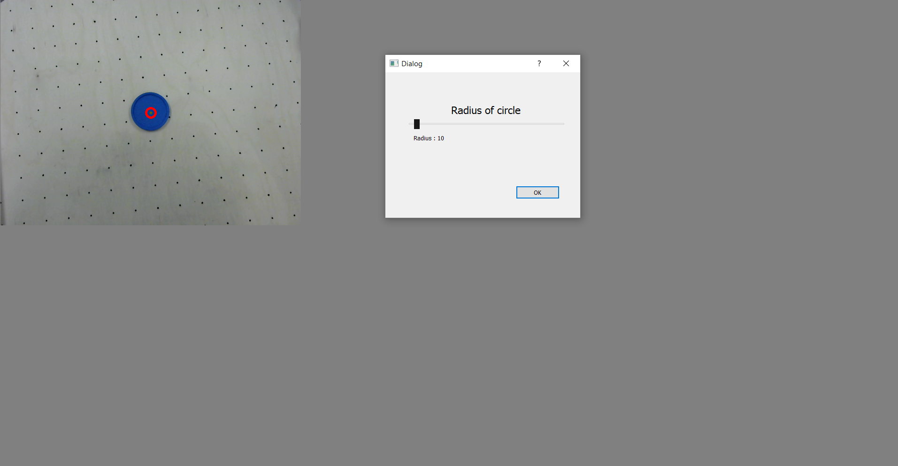
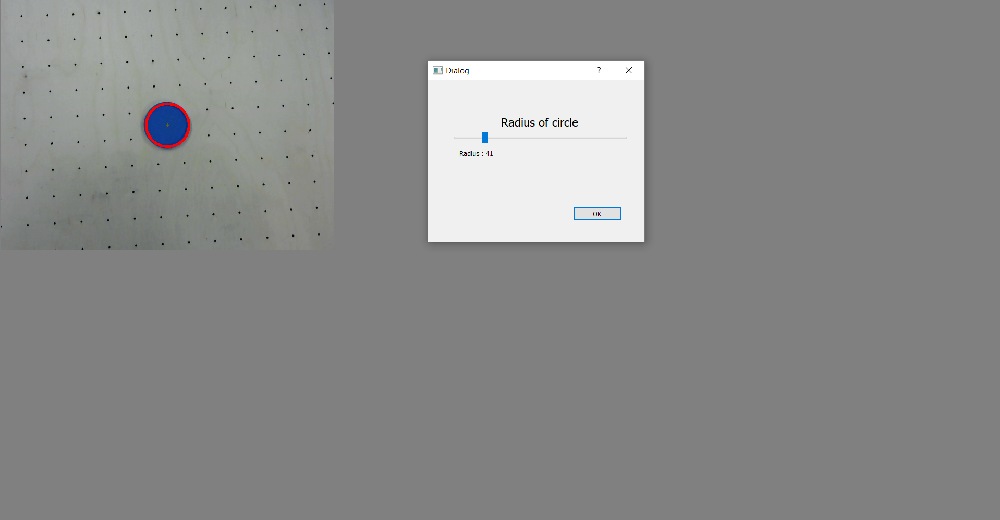
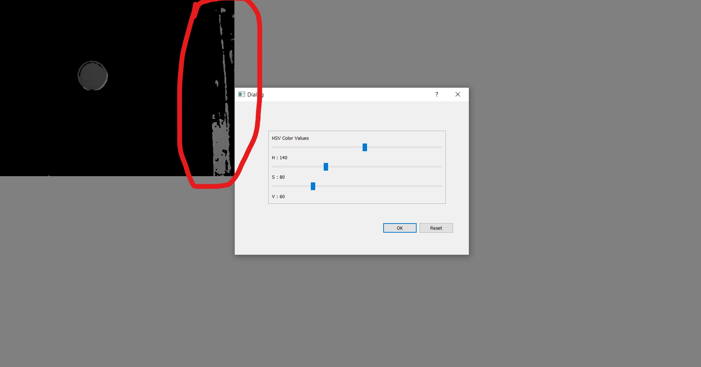
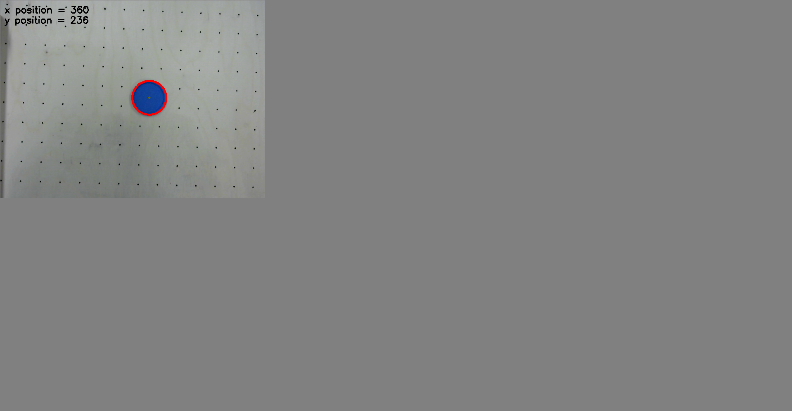

# Vision calibration

## Centering the puck

When you will launch the calibration process, the puck will most likely not be in the center of the screen. Place the puck at the center of the red calibration circle.

## Adjusting the radius

The red calibration circle must have the same size as the puck. Use the slider to adjust the radius.

## Launching the autoconfiguration process

When you are satisfied, press the "OK" button to launch the autoconfiguration process (this may take a while).

## Adjusting the HSV values

After the autoconfiguration process is over, the puck should be clearly visible, but noise might also be present (i.e, there may be other elements that standout as well (the noise is circled in red on the provided picture)). The HSV sliders (https://en.wikipedia.org/wiki/HSL_and_HSV#Basic_principle) can be used to remove the noise. If after changing their values you eventually can't see the puck anymore, you can press the "Reset" button to reapply the values that were calculated by the autoconfiguration process. When you are satisfied with the result, press the "OK" button.

## Ready to play ! 

If the calibration process was successful, the display should circle the puck as you move it around and indicate its X and Y positions. 