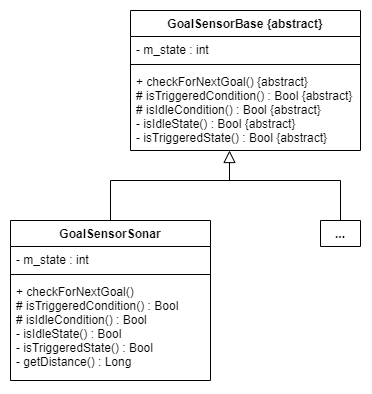

# The Score Package
This package is responsible for keeping track of the scores. If you follow our building tutorial, this function is supported by sonars. 

# Code's architecture
The [SOLID](https://scotch.io/bar-talk/s-o-l-i-d-the-first-five-principles-of-object-oriented-design) principles have been central to the design of the Score package. As such, if you have ideas on how to improve the code's architecture in regard of these principles, please feel free to start an issue or to start a merge request. Note that the following isn't formal UML : the majority of attributes and methods are not shown : only a select few are. This was done in order to not overload the diagrams and to attract the reader's attention to the classes relationships and hierarchies.
## Interfaces and their implementations

In order to respect the Dependency Inversion and the Open-closed principles, and interface was created. As such, GoalSensorBase is an abstract classes. Concrete implementations, such as GoalSensorSonar, are not known by other classes. Indeed, these other classes receive a pointer of the abstract classes type. For example,the Goal class must use a GoalSensorBase object. However, the Goal class doesn't have a GoalSensorSonar as one of its attributes : it has a GoalSensorBase (abstract base class) pointer. This enforces the Open-closed principle : the Goal class is closed for modification, but opened for extension. Thus, if one wishes to use an alternative sensor (such as a limit switch), then a corresponding concrete classe can be added and a pointer can be passed to the dependant classes : there is no need to modify the existing code. This is represented by the "..." classes. This was done, as was said, in order to respect the SOLID principles, but also in an open source spirit, as a way to facilitate the growth and developpement of the code by you, the contributor. 