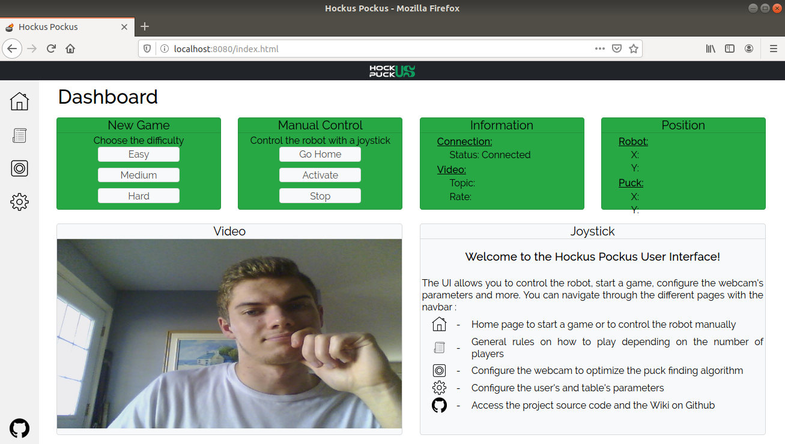

# The UI Package
## Description
This package is responsible for the WebApp. Using rosbridge_server, roslibjs, web_video_server and Python's SimpleHTPPServer, it has access to the topics and the video. Once the main package is launched, the WebApp will open automatically and you'll be able the see your webcam's feed. Here is an exemple of the expected result. 

The WebApp is hosted on port 8080, which is set in *src/server.py*. web_video_server is hosted on 7070, which can be changed in the launch file *ui.launch*. For rosbridge_server, its default port is 9090, and it can't be change right now.

## Usage
In the [Wiki](https://github.com/victoriapc/HockusPockus/wiki), you cand find a guide to navigate through the WebApp's functions, like starting a new game, controlling the robot manually and changing the parameters.