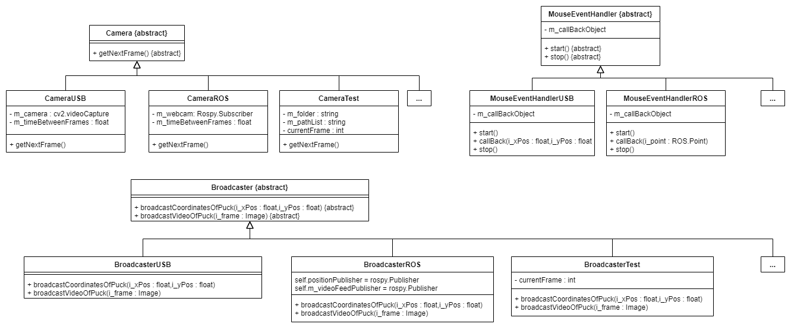
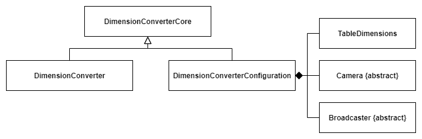
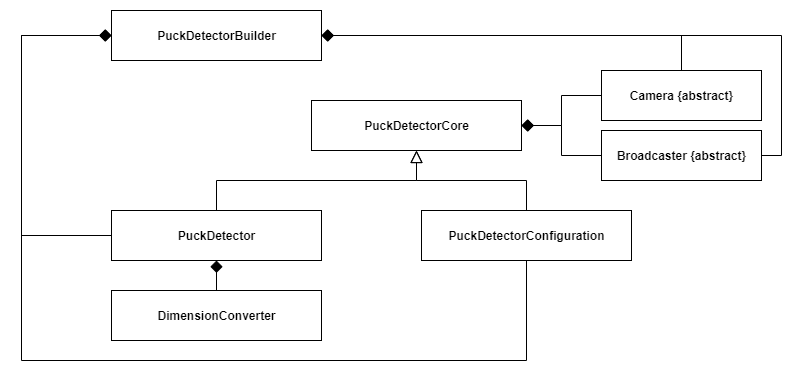

# The Vision Package
This package is responsible on finding the puck and returning its position. By receiving the webcam's video on a topic named */usb_cam/image_raw*, it uses CvBridge and Open CV to output a modified image on the topic */usb_cam/image_output*.

The package is also responsible for the camera calibration. To get more information on this, you can see the "Using the user interface to configure the vision algorithm" wiki

# Code's architecture
The [SOLID](https://scotch.io/bar-talk/s-o-l-i-d-the-first-five-principles-of-object-oriented-design) principles have been central to the design of the Vision package. As such, if you have ideas on how to improve the code's architecture in regard of these principles, please feel free to start an issue or to start a merge request. Note that the following isn't formal UML : the majority of attributes and methods are not shown : only a select few are. This was done in order to not overload the diagrams and to attract the reader's attention to the classes relationships and hierarchies.
## Interfaces and their implementations

In order to respect the Dependency Inversion and the Open-closed principles, interfaces were created. As such, Camera, Broadcaster and MouseEventHandler are all abstract classes. Concrete implementations, such as CameraUSB, are not known by other classes. Indeed, these other classes receive a pointer of the abstract classes type. For example, as it is presented below, the PuckDetector class must use a Camera object. However, the PuckDetector class doesn't have a CameraUSB pointer or a CameraROS pointer as one of its attributes : it has a Camera (abstract base class) pointer. This enforces the Open-closed principle : the PuckDetector class is closed for modification, but opened for extension. Thus, if one wishes to use an alternative robotic toolkit (such as MRDS), then corresponding concrete classes can be added and pointers can be passed to the dependant classes through the PuckDetectorBuilder : there is no need to modify the existing code. This is represented by the "..." classes. This was done, as was said, in order to respect the SOLID principles, but also in an open source spirit, as a way to facilitate the growth and developpement of the code by you, the contributor. 

## DimensionConverter

In order to respect the single-responsiblity principle, the above's hierarchy was adopted. The code related to the configuration of the DimensionConverter's class configuration was isolated in a class. Therefore, the DimensionConverter class isn't bloated with getters and setters that are only used in the configuration process. The DimensionConverterCore class is used to regroup code that is common to DimensionConverter and DimensionConverterConfiguration, in order to avoid duplicated code.

## PuckDetector

As with the DimensionConverter package, the above's hierarchy was adopted to respect the single-responsiblity principle. The PuckDetectorBuilder class's sole responsiblity is to assemble a PuckDetector object from multiple classes, by, notably, using the PuckDetectorConfiguration class. As such, the one and only switch case related to the selection of one of the various modes (USB,ROS,...) is here, in the constructor of the PuckDetectorBuilder class. The effects of the design choices related to the Dependency Inversion and the Open-closed principles can be appreciated here : code relating a new technology can be added without changing a single line of code here (except for an additional entry in the switch case statement of the PuckDetectorBuilder class).